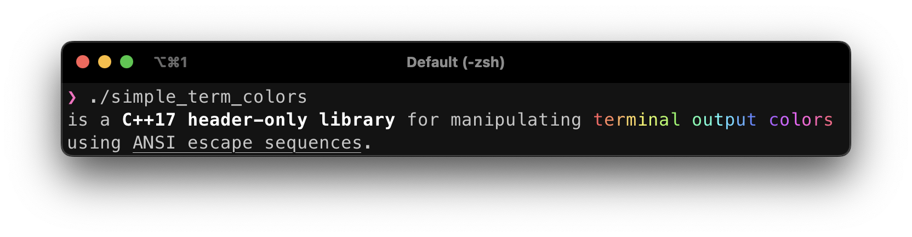
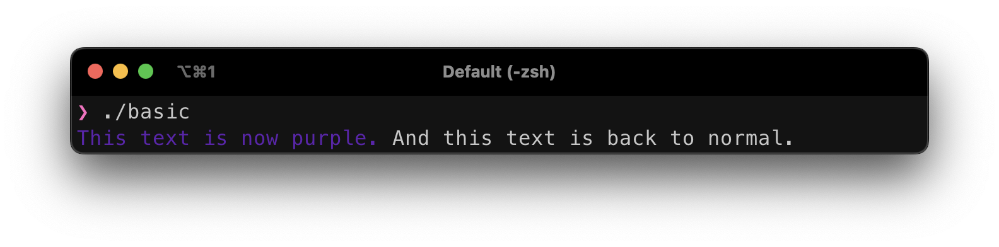
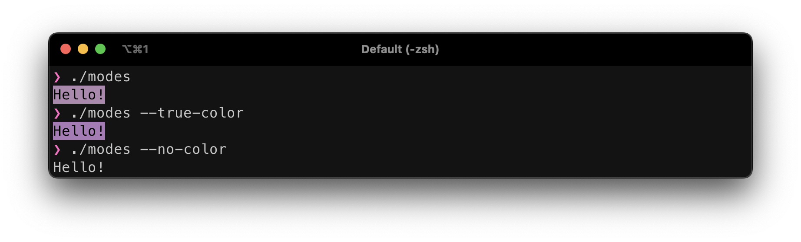
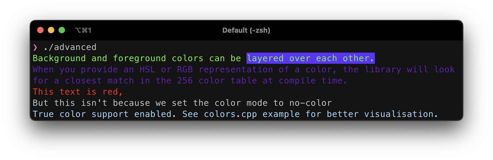
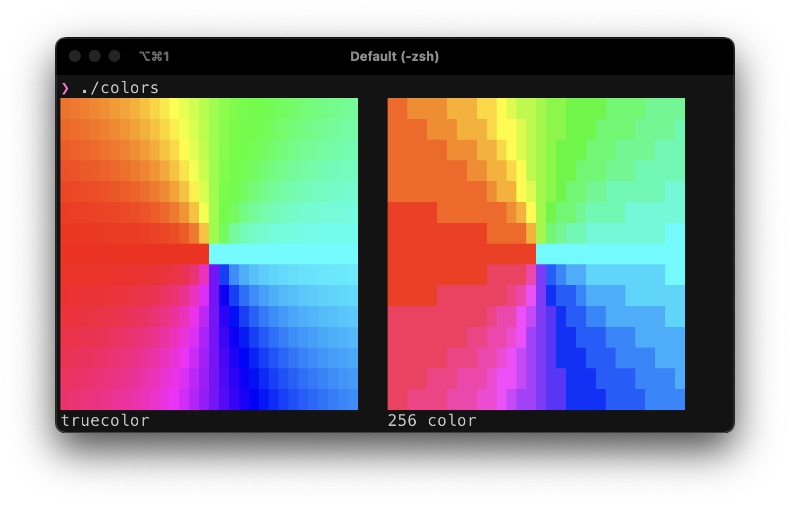

# Features
- Support for true color, 256 color and black and white terminals. The type of color escape sequences emitted can be changed at runtime.
- RGB and HSL support.
- Computation is done at compile-time, whenever possible.
- MIT license.

# Usage
## Colors
- `stc::rgb_fg(r, g, b)` sets the foreground color using RGB color model.
- `stc::rgb_bg(r, g, b)` sets the background color using RGB color model.
- `stc::hsl_fg(r, g, b)` sets the foreground color using HSL color model.
- `stc::hsl_bg(r, g, b)` sets the background color using HSL color model.

## Extras
- `stc::reset` resets the output style.
- `stc::bold` makes the text bold.
- `stc::underline` makes the text underlined.
- `stc::inverse` swaps the background and foreground colors.
- `stc::crossed_out` makes the text crossed out. (~~example~~)
> terminal support may vary for underline and crossed out.

## Color modes
- `src::color_256` sets the color mode to 256 color. (default)
- `stc::true_color` sets the color mode to true color.
- `stc::no_color` disables all color codes from being emitted to the stream. Note: if you set a style before dont forget to use `stc::reset`, as it will still be visible even after you change the color mode. This mode simply guarantees no color codes will be printed, but it does not erase already existing ones.

# Examples
## Basic usage
```cpp
#include "stc.hpp"
#include <iostream>

int main() {
  std::cout << stc::rgb_fg(95, 21, 191) << "This text is now purple. "
            << stc::reset << "And this text is back to normal.\n";
  return 0;
}
```


## Color modes
```cpp
#include "stc.hpp"
#include <iostream>

int main(int argc, char **argv) {
  using namespace std;
  
  string mode{};
  if (argc == 2)
    mode = argv[1];
  // 256 color mode is set by default

  if (mode == "--no-color")
    cout << stc::no_color;
  else if (mode == "--true-color")
    cout << stc::true_color;
  
  // no extra logic needed when printing.
  cout << stc::rgb_fg(0, 0, 0) << stc::hsl_bg(0.8, 0.3, 0.6) << "Hello!" << stc::reset << '\n';
  return 0;
}
```


## Advanced usage
```cpp
#include <iostream>
#include "stc.hpp"

int main() {
  using namespace std;
  cout << stc::hsl_fg(0.3, 1, 0.5) << "Background and foreground colors can be " << stc::hsl_bg(0.7, 1, 0.5) << "layered over each other." << stc::reset << '\n';

  constexpr auto my_fav_color = stc::rgb_fg(95, 21, 191);
  cout << my_fav_color << "When you provide an HSL or RGB representation of a color, the library will look for a closest match in the 256 color table at compile time.\n" << stc::reset;
  static_assert(my_fav_color.code == 55); // passes

  cout << stc::rgb_fg(255, 0, 0) << "This text is red,\n" << stc::reset;
  cout << stc::no_color << stc::rgb_fg(255, 0, 0) << "But this isn't because we set the color mode to no-color\n" << stc::reset;

  cout << stc::true_color << stc::hsl_fg(0.55, 0.9, 0.8) << "True color support enabled. See colors.cpp example for better visualisation.\n";
  return 0;
}
```


## Color wheels
```cpp
#include <iomanip>
#include <iostream>

#include "stc.hpp"

void print_colors() {
  using namespace std;
  const int sizei = 15;
  const int sizej = sizei * 2;
  for (int i = 0; i < sizei; i++) {
    for (int k = 0; k < 2; k++) {
      if (k == 0)
        cout << stc::true_color;
      else
        cout << stc::color_256;
      for (int j = 0; j < sizej; j++) {
        const int x = i - (sizei / 2), y = j - (sizej / 2);
        const float pi = 3.141593;
        const float h = (pi + atan2((float)x, float(y))) / (2 * pi);
        cout << stc::hsl_bg(h, 1, 0.5F) << " ";
      }
      cout << stc::reset << "   ";
    }
    cout << '\n';
  }
}

int main() {
  print_colors();
  std::cout << "truecolor" << std::setw(33) << "256 color" << '\n';
  return 0;
}
```
